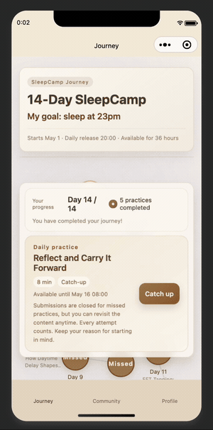
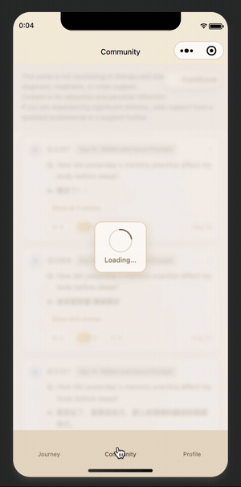
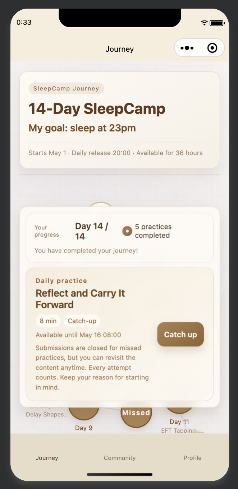
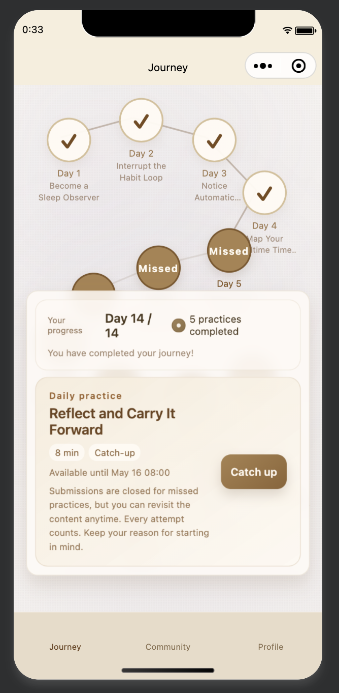
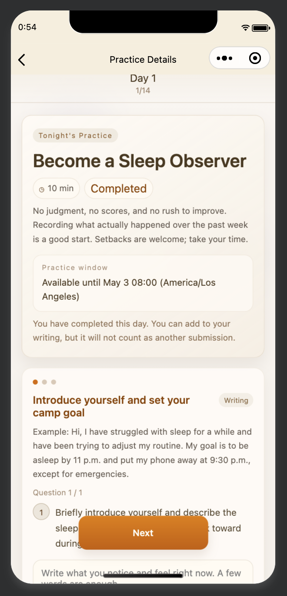
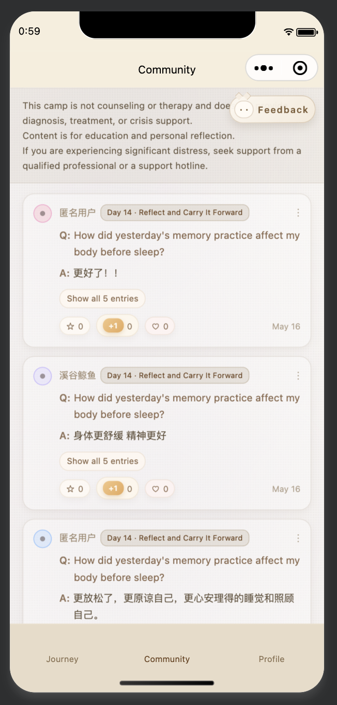
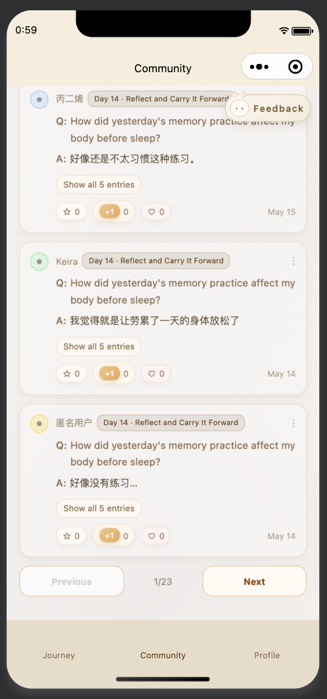
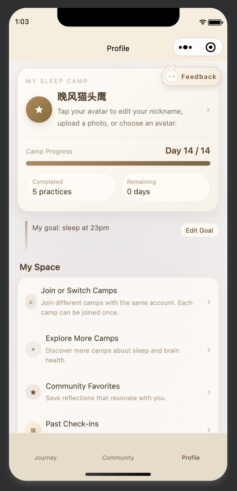

# SleepCamp: selected source portfolio

SleepCamp is a personal WeChat Mini Program project. This public edition preserves its folder organization and a selection of readable engineering examples. It is intentionally incomplete and disconnected: it cannot launch the original app or execute its product workflow.

## UI Preview

### Animated walkthroughs

<table>
  <tr>
    <td align="center"></td>
    <td align="center"></td>
    <td align="center"></td>
  </tr>
</table>

### Screenshots

<table>
  <tr>
    <td align="center"><br/><sub><b>UI1: Journey</b></sub></td>
    <td align="center"><br/><sub><b>UI1: Journey</b></sub></td>
    <td align="center"><br/><sub><b>UI2: Camp detail</b></sub></td>
  </tr>
  <tr>
    <td align="center"><br/><sub><b>UI3: Community</b></sub></td>
    <td align="center"><br/><sub><b>UI3: Community with 150+ beta users</b></sub></td>
    <td align="center"><br/><sub><b>UI4: Profile</b></sub></td>
  </tr>
</table>

## Suggested reading order

1. [Page lifecycle sample](miniprogram/pages/task/detail/index.js): loading, errors, retry, and protection against stale asynchronous responses.
2. [Read cache](miniprogram/services/read-cache.js): concurrent request deduplication, expiry, and invalidation.
3. [Reusable component](miniprogram/components/completion-banner/index.js): properties separated from its WXML template and WXSS styling.
4. [Presentation types](miniprogram/types/index.ts) and [utility functions](miniprogram/utils): small interfaces and explicit validation.

## Structure

```text
miniprogram/
  app.js / app.json / app.wxss  Architecture placeholders and neutral styling
  assets/                     Omission note; no original media
  components/                 One translated component excerpt
  mock/                       Omission note; no curriculum or connected fixtures
  pages/                      Original screen directories; one adapted excerpt
  services/                   Generic cache and an unavailable data boundary
  types/                      Selected presentation types
  utils/                      Generic state and text helpers
cloudfunctions/               Original function directories; descriptions only
docs/                       Architecture, scope, and source provenance
```

The original page locations and cloud-function names are retained to show the application's breadth. A directory containing only a README is a withheld module, not an implemented feature. Legacy duplicate TypeScript files, dependencies, operational tooling, and deployment files are excluded.

## What is withheld

Daily titles, exercises, writing prompts, audio, original assets, full screen implementations, navigation, authentication, membership and access-code rules, submission and community workflows, database schemas, and production identifiers are excluded. There are no cloud-function handlers.

The app has no registered routes, the page excerpt has no `Page` registration, and the data boundary rejects by default. Connecting the samples requires independently supplying the missing systems and content. The visible generic code can still be read and reused; no public repository can prevent independent development of a similar product.

See [architecture and scope](docs/ARCHITECTURE.md), [source provenance](docs/PROVENANCE.md), and [publishing instructions](PUBLISHING.md).
